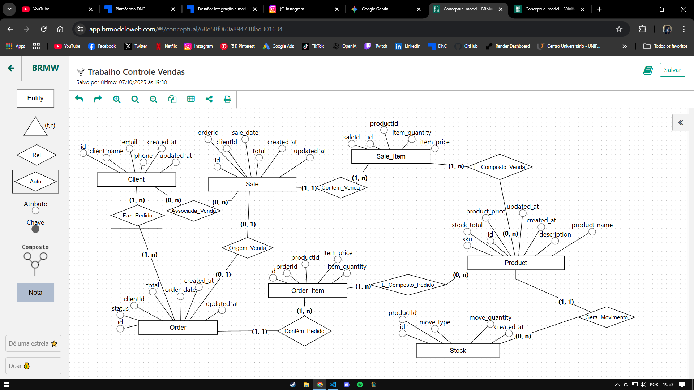

# API Controle de Vendas

API REST para gerenciamento de vendas, produtos e estoque desenvolvida com Node.js, Express e Prisma.

## 💡 Sobre o Projeto

Sistema de gerenciamento para a DNCommerce, uma loja online de produtos de beleza, permitindo:

- Cadastro de produtos
- Gestão de estoque
- Registro de pedidos
- Controle de vendas
- Cadastro de clientes

## 📊 Modelagem do Banco de Dados



### Entidades e Relacionamentos

- **Client (Cliente)**
  - Realiza pedidos
  - Possui vendas associadas
- **Product (Produto)**
  - Possui estoque
  - Participa de pedidos
  - Está presente em vendas

- **Order (Pedido)**
  - Pertence a um cliente
  - Contém itens (produtos)
  - Pode gerar uma venda

- **Sale (Venda)**
  - Pode estar associada a um pedido
  - Pertence a um cliente
  - Contém itens vendidos

- **Stock (Estoque)**
  - Registra movimentações de produtos
  - Controla entrada/saída

## 🚀 Tecnologias Utilizadas

- Node.js
- TypeScript
- Express
- Prisma ORM
- SQLite
- Zod (validação)

## 📋 Pré-requisitos

- Node.js (versão 14 ou superior)
- NPM ou Yarn

## 🔧 Instalação

```bash
# Clone o repositório
git clone https://github.com/seu-usuario/api-controle-vendas.git

# Entre na pasta do projeto
cd api-controle-vendas

# Instale as dependências
npm install

# Configure as variáveis de ambiente
cp .env.example .env

# Execute as migrations
npm run prisma:migrate

# Inicie o servidor
npm run dev
```
